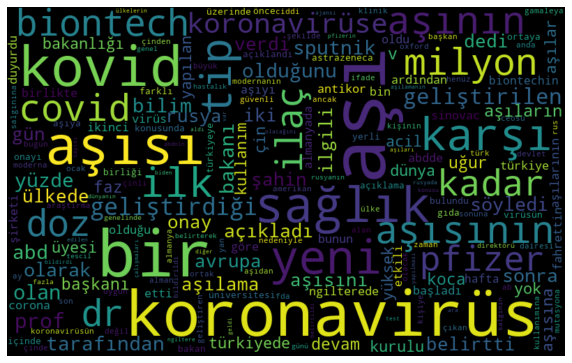
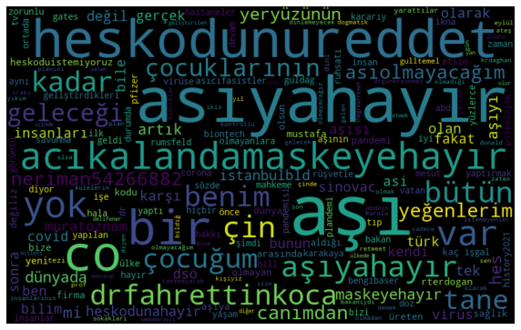
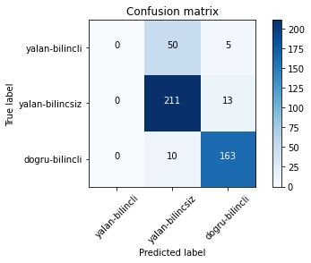
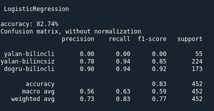

# Türkçe Sahta Haber Belirleme

Bilindiği üzere sosyal medyada her türlü haber(doğru, bilinçsiz yanlış ya da bilinçli yanlış) çok hızlı bir şekilde yayılabilmektedir. Bu proje kapsamında sosyal medyada (Twitter) yayılan haberleri öncelikle doğru ya da yanlış olduğuna, daha sonrasında ise yanlış verilmiş ise bilinçli ya da bilinçsiz olduğuna dair bir veri madenciliği projesi oluşturulmuştur.

## ➤ Veri Setlerinin Oluşturulması

Sahte haberleri oluşturmak için belli başlık altında atılan tweetleri topladım. Bu proje genelinde aşıyı incelediğim için arama kelimesi olarak "aşıyahayır, aşıolmayacagım..." gibi başlıklardan oluşan tweetleri yalan haber olarak etiketledim. Gerçek haberleri ise güvenilir haber siteleri ve Twitter kullanıcılarından toplayarak oluşturdum. 

> **NOT:** Kişisel bilgiler bulunduğu için verisetlerini paylaşmadım.

## ➤ Algoritma

Veri setlerini oluşturduktan sonra veri temizleme işlemleri gerçekleştirdim. Bunlar Türkçe kelimelerin düzeltilmesi, noktalama işaretlerinin temizlenmesi, Türkçe stopwords'lerin kaldırılması, veri modelini yanlış yönlendirecek kelimeleri temizlenmesi (RT,HTTPS,...) ve büyük küçük harf uyumunu sağlayarak veri seti üzerinde tekilliği sağladım.

> **ÖRNEK:**   <li> Aşıya HAYIR. ---> aşıya hayır   <li> Aşı otizme yol acan bir sey. ---> aşı otizme yol açan bir şey

Veri setleri üzerinde temizleme işlemi yaptıktan sonra modeli oluşturup, sırasıyla Logistic Regression, Decision Tree, Random Forest Classifier algoritmalarını çalıştırdım.

## ➤ Proje Çıktıları

<b>Gerçek Haber Kelime Bulutu</b>    <b>Yalan Haber Kelime Bulutu</b>    <b>Confusion Matrix</b>    <b>Algoritma Çıktısı</b> 

 

> **NOT:**   Projede 900 yalan 900 gerçek haber verisi üzerinde modeli geliştirdim ancak veri sayısı az geldiği için algoritmanın çıktısı modelin her oluşumunda birbirine yakın farklı sonuçlar üretmektedir. "Algoritma Çıktısı" verisinde görülebileceği gibi "yalan-bilincli" verisinden anlamlı bir çıktı üretememektedir. Veri setinin daha da genişletilmesiyle daha kesin sonuçlar üretilebilir.

## Lisans

Simurg MIT lisansı ile lisanslanmıştır.
